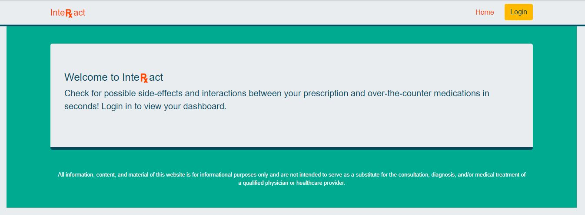

# InteRXact

Users login to begin using the dashboard to search for interactions and side-effects between prescription medications. Searches are saved to their (private) dashboard. A button is available to view the results of previous searches as well.

Note: If you have seen the repo fireballsProject2 then this is a complete rebuild of that project, migrating to different technologies.

[Visit InteRXact!](https://interxact3.herokuapp.com/)

## Technnologies:

React.js, MongoDB, Express.js, Node.js, Auth0, CSS (Bootstrap)

## Home Page Pre-Login:

## Dashboard Page Available Post-Login:

